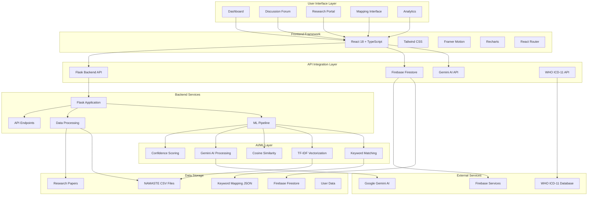
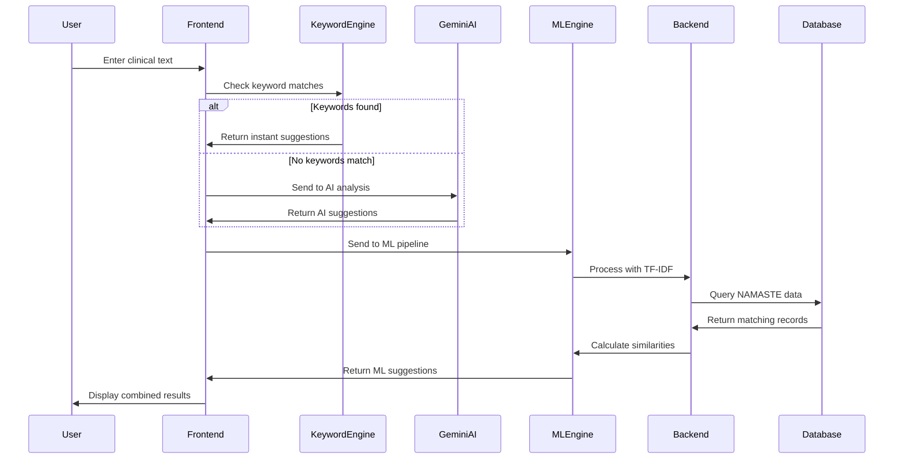
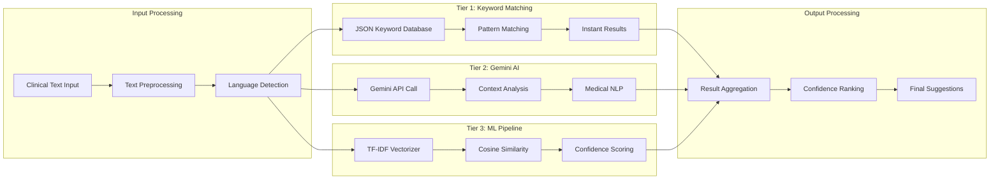
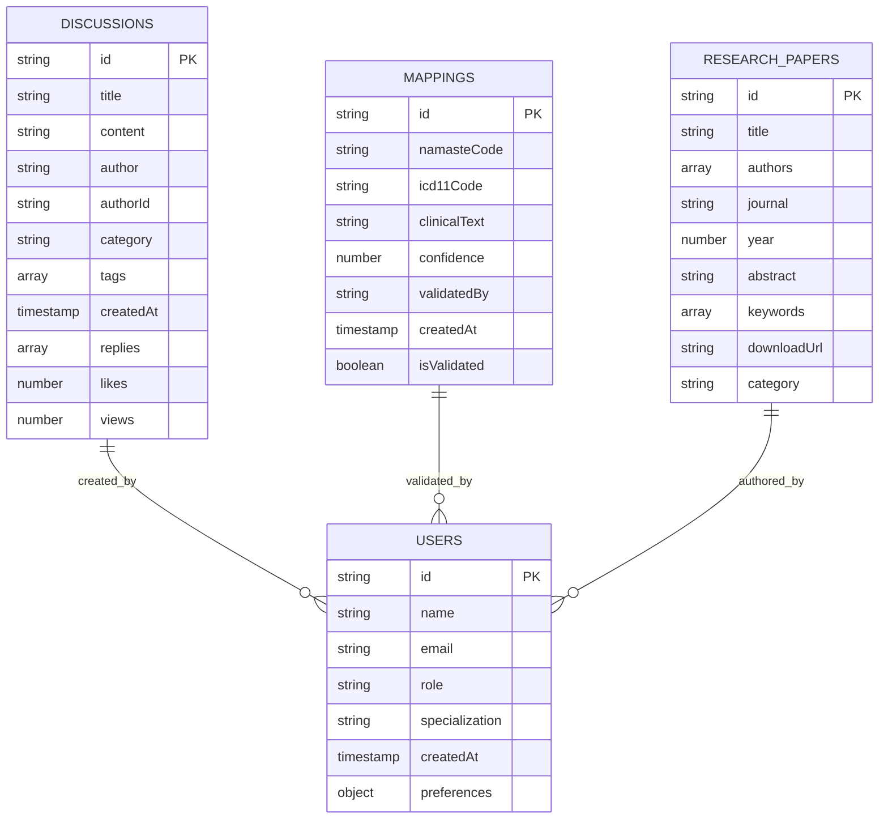
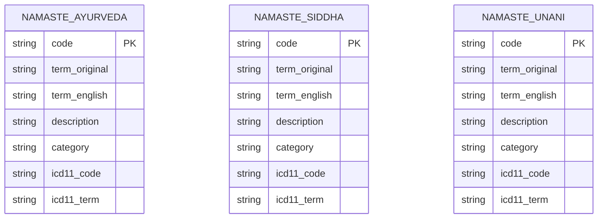
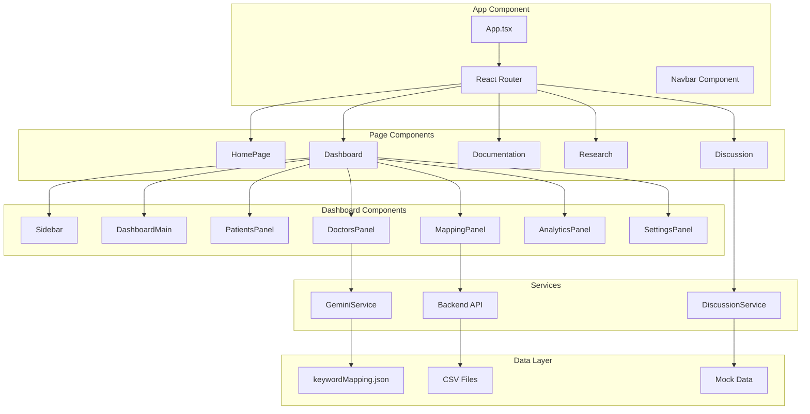
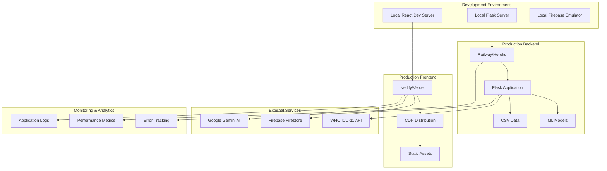
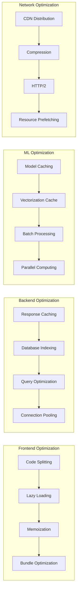
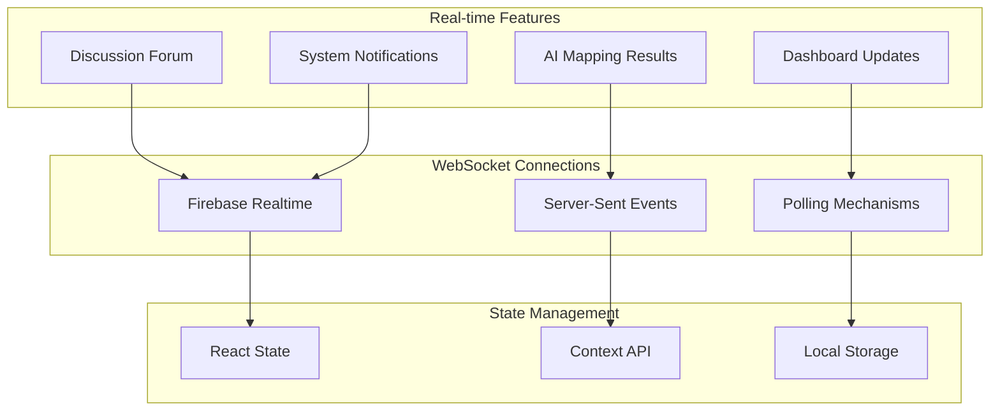

# System Architecture - Namaste Ayurveda EHR

## 🏗️ Complete System Architecture

## 🔄 Data Flow Architecture

## 🧠 AI/ML Pipeline Architecture

## 📊 Database Schema

### Firebase Firestore Collections

### CSV Data Structure

## 🔧 Component Architecture

## 🚀 Deployment Architecture

## 🔐 Security Architecture

```mermaid
graph TB
    subgraph "Authentication Layer"
        AUTH1[Firebase Auth]
        AUTH2[JWT Tokens]
        AUTH3[Role-based Access]
    end
    
    subgraph "API Security"
        SEC1[CORS Configuration]
        SEC2[Rate Limiting]
        SEC3[Input Validation]
        SEC4[API Key Management]
    end
    
    subgraph "Data Security"
        DATA1[Firestore Rules]
        DATA2[Environment Variables]
        DATA3[Encrypted Storage]
    end
    
    subgraph "Network Security"
        NET1[HTTPS Encryption]
        NET2[Secure Headers]
        NET3[Content Security Policy]
    end
    
    AUTH1 --> AUTH2
    AUTH2 --> AUTH3
    
    SEC1 --> SEC2
    SEC2 --> SEC3
    SEC3 --> SEC4
    
    DATA1 --> DATA2
    DATA2 --> DATA3
    
    NET1 --> NET2
    NET2 --> NET3
```

## 📈 Performance Architecture

## 🔄 Real-time Data Flow

This architecture provides a comprehensive view of how all components interact in the Namaste Ayurveda EHR system, from user interface to data storage, ensuring scalability, security, and performance.