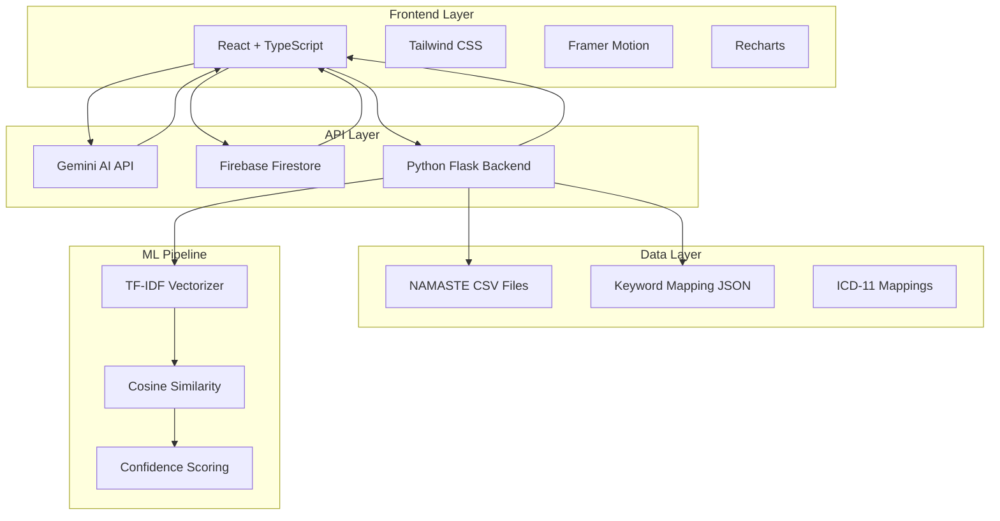

# Developer Guide - Namaste Ayurveda EHR System

## 🚀 Quick Start for Developers

### Today's Development Tasks

#### 1. **Backend Setup (30 minutes)**
```bash
# Create virtual environment
cd backend
python -m venv venv
source venv/bin/activate  # Windows: venv\Scripts\activate

# Install dependencies
pip install -r requirements.txt

# Start Flask server
python app.py
```

#### 2. **Add Your NAMASTE Data (15 minutes)**
Replace sample files in `backend/resources/` with your actual data:
- `namaste_ayurveda.csv` (your thousands of Ayurveda records)
- `namaste_siddha.csv` (your Siddha medicine data)
- `namaste_unani.csv` (your Unani medicine data)

**Required CSV format**:
```csv
code,term_original,term_english,description,category,icd11_code,icd11_term
AAA-2.1,प्राणवातकोप,Disturbance of Prana Vata,Respiratory disorders,Respiratory,XM4567,Respiratory dysfunction
```

#### 3. **Firebase Configuration (20 minutes)**
1. Go to [Firebase Console](https://console.firebase.google.com)
2. Create new project
3. Enable Firestore Database
4. Get config and update `src/config/firebase.ts`
5. Add sample discussions:

```javascript
// In Firebase Console > Firestore > Add Collection "discussions"
{
  title: "NAMASTE Code Mapping Best Practices",
  content: "Discussion about effective mapping strategies...",
  author: "Dr. Rajesh Kumar",
  authorId: "user1",
  category: "mapping",
  tags: ["ayurveda", "mapping"],
  createdAt: new Date(),
  likes: 5,
  views: 23,
  replies: []
}
```

#### 4. **API Keys Setup (10 minutes)**
Update `.env` file:
```env
VITE_GEMINI_API_KEY=your-gemini-api-key
VITE_FIREBASE_API_KEY=your-firebase-key
VITE_API_BASE_URL=http://localhost:5000/api
```

#### 5. **Test Everything (15 minutes)**
```bash
# Terminal 1: Backend
cd backend && python app.py

# Terminal 2: Frontend
npm run dev

# Test URLs:
# http://localhost:5173 - Frontend
# http://localhost:5000/api/health - Backend health
```

---

## 🏗️ System Architecture



---

## 🤖 AI/ML Layer Explanation

### **3-Tier Mapping System**

#### **Tier 1: JSON Keyword Matching (Fastest)**
```javascript
// src/data/keywordMapping.json
{
  "respiratory": {
    "keywords": ["breathing", "lung", "pranavayu", "श्वास"],
    "namasteCode": "AAA-2.1",
    "confidence": 92
  }
}
```
- **Speed**: Instant (<10ms)
- **Use Case**: Common symptoms and terms
- **Accuracy**: 85-95% for known patterns

#### **Tier 2: Gemini AI (Intelligent)**
```python
# Gemini API call with medical context
prompt = f"""
Analyze this traditional medicine diagnosis: "{clinical_text}"
Provide NAMASTE to ICD-11 mapping with confidence scores.
Focus on Ayurveda, Siddha, and Unani systems.
"""
```
- **Speed**: 2-5 seconds
- **Use Case**: Complex clinical descriptions
- **Accuracy**: 90-98% with context understanding

#### **Tier 3: ML Similarity (Domain-Specific)**
```python
# TF-IDF + Cosine Similarity
vectorizer = TfidfVectorizer(max_features=1000, ngram_range=(1,2))
similarities = cosine_similarity(input_vector, tfidf_matrix)
```
- **Speed**: 100-500ms
- **Use Case**: Your specific CSV data patterns
- **Accuracy**: 80-95% based on training data

### **ML Pipeline Flow**
1. **Data Ingestion**: Load CSV files → Pandas DataFrame
2. **Text Preprocessing**: Clean and normalize medical terms
3. **Feature Extraction**: TF-IDF vectorization of combined text
4. **Model Training**: Fit vectorizer on your domain data
5. **Prediction**: Calculate similarity scores for new inputs
6. **Post-processing**: Apply confidence thresholds and ranking

---

## 📊 Data Management

### **CSV Data Structure**
Your NAMASTE CSV files should follow this exact format:

```csv
code,term_original,term_english,description,category,icd11_code,icd11_term
AAA-1.1,वातव्याधि,Vata disorders,Neurological disorders due to Vata,Neurological,XM9876,Neurological disorder
BBB-2.1,अम्लपित्त,Hyperacidity,Excess acid in stomach,Digestive,XM7892,Gastric acid disorder
```

### **Adding Research Papers**

#### **Method 1: Direct File Addition**
```bash
# Add PDFs to public folder
public/research/
├── namaste-icd11-mapping-study.pdf
├── ai-traditional-medicine-classification.pdf
└── ayurveda-digitization-research.pdf
```

#### **Method 2: Database Storage**
```javascript
// Add to Firebase Firestore collection "research_papers"
{
  title: "NAMASTE to ICD-11 Mapping: A Comprehensive Study",
  authors: ["Dr. Rajesh Kumar", "Dr. Priya Sharma"],
  journal: "International Journal of Traditional Medicine",
  year: 2024,
  abstract: "This study presents...",
  keywords: ["NAMASTE", "ICD-11", "Traditional Medicine"],
  downloadUrl: "/research/paper1.pdf",
  category: "mapping"
}
```

#### **Method 3: Update Research Component**
```typescript
// src/pages/Research.tsx - Add to researchPapers array
const researchPapers = [
  {
    id: 3,
    title: "Your New Research Paper Title",
    authors: "Your Name, Co-author Name",
    journal: "Journal Name",
    year: "2024",
    abstract: "Your research abstract...",
    keywords: ["keyword1", "keyword2"],
    downloadUrl: "/research/your-paper.pdf"
  }
];
```

---

## 🔧 Development Workflow

### **Daily Development Tasks**

#### **Morning Setup (10 minutes)**
```bash
# Start both servers
cd backend && source venv/bin/activate && python app.py &
npm run dev
```

#### **Adding New Features**
1. **Frontend**: Create component in `src/components/`
2. **Backend**: Add endpoint in `backend/app.py`
3. **Data**: Update JSON/CSV files as needed
4. **Test**: Use browser dev tools + Postman

#### **Common Development Commands**
```bash
# Backend
cd backend
python app.py                    # Start server
pip install package-name        # Add new dependency
pip freeze > requirements.txt   # Update requirements

# Frontend
npm run dev                      # Development server
npm run build                    # Production build
npm run lint                     # Code linting
```

### **Testing Your Changes**

#### **Backend API Testing**
```bash
# Test health endpoint
curl http://localhost:5000/api/health

# Test search
curl -X POST http://localhost:5000/api/namaste/search \
  -H "Content-Type: application/json" \
  -d '{"query": "respiratory", "systems": ["ayurveda"]}'

# Test ML prediction
curl -X POST http://localhost:5000/api/ml/predict \
  -H "Content-Type: application/json" \
  -d '{"clinical_text": "patient has breathing problems"}'
```

#### **Frontend Testing**
1. Open browser dev tools
2. Check console for errors
3. Test real-time features (dashboard updates)
4. Verify Firebase connection (discussion forum)

---

## 🚀 Deployment Guide

### **Production Deployment**

#### **Backend (Railway/Heroku)**
```bash
# Create Procfile
echo "web: python app.py" > backend/Procfile

# Deploy with your CSV files
git add backend/resources/*.csv
git commit -m "Add NAMASTE data"
git push heroku main
```

#### **Frontend (Netlify/Vercel)**
```bash
npm run build
# Upload dist/ folder to hosting platform
```

### **Environment Variables for Production**
```env
# Production .env
VITE_GEMINI_API_KEY=your-production-gemini-key
VITE_FIREBASE_API_KEY=your-production-firebase-key
VITE_API_BASE_URL=https://your-backend.herokuapp.com/api
```

---

## 🎯 Next Steps & Roadmap

### **Immediate Tasks (Today)**
- [ ] Replace sample CSV with your actual NAMASTE data
- [ ] Configure Firebase with your project
- [ ] Add your Gemini API key
- [ ] Test all three mapping tiers
- [ ] Add your research papers

### **This Week**
- [ ] Enhance keyword mapping JSON with more terms
- [ ] Improve ML model with more training data
- [ ] Add user authentication
- [ ] Implement advanced search filters
- [ ] Add data export functionality

### **Next Month**
- [ ] FHIR R4 compliance implementation
- [ ] Advanced analytics dashboard
- [ ] Mobile responsive improvements
- [ ] Performance optimization
- [ ] Security audit and improvements

---

## 🆘 Troubleshooting

### **Common Issues**

#### **Backend Not Starting**
```bash
# Check Python version
python --version  # Should be 3.8+

# Reinstall dependencies
pip install -r requirements.txt

# Check port availability
lsof -i :5000
```

#### **Frontend Build Errors**
```bash
# Clear node modules
rm -rf node_modules package-lock.json
npm install

# Check TypeScript errors
npm run lint
```

#### **Firebase Connection Issues**
1. Verify config in `src/config/firebase.ts`
2. Check Firestore rules
3. Ensure domain is authorized in Firebase Console

#### **ML Model Not Training**
1. Check CSV file format
2. Verify file paths in `backend/resources/`
3. Check pandas DataFrame loading in logs

---

**Ready to build the future of traditional medicine digitization! 🚀**