# 🏗️ NAMASTE System Architecture

## System Overview

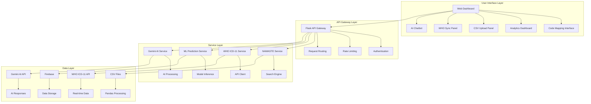

## Data Processing Flow

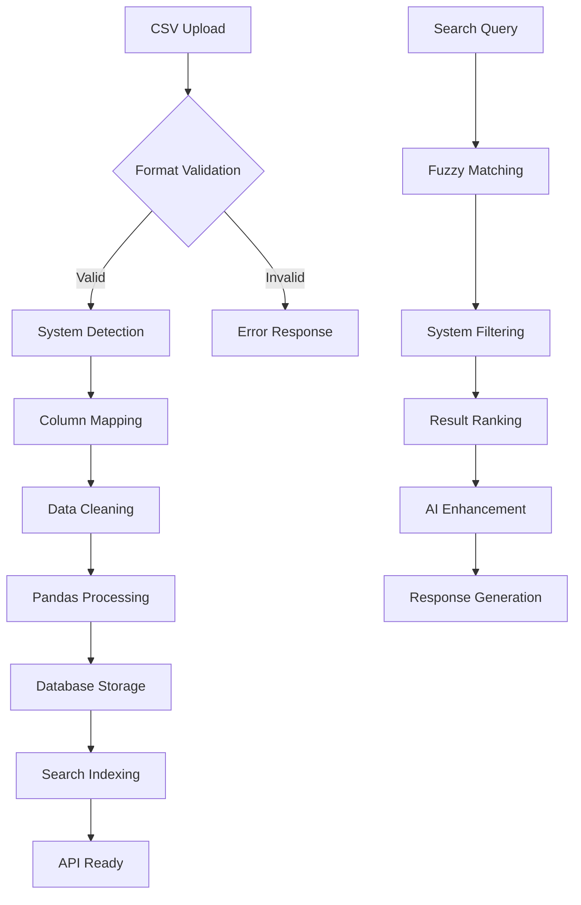

## AI Integration Architecture

```mermaid
graph LR
    subgraph "Input Processing"
        A[User Query] --> B[Text Preprocessing]
        B --> C[Context Extraction]
    end
    
    subgraph "AI Processing"
        D[Gemini AI] --> E[Medical Analysis]
        E --> F[Similarity Scoring]
        F --> G[Mapping Generation]
        G --> H[Explanation Creation]
    end
    
    subgraph "Output Processing"
        I[Response Formatting] --> J[Markdown Conversion]
        J --> K[UI Rendering]
    end
    
    C --> D
    H --> I
    K --> L[User Interface]
```

## WHO ICD-11 Integration

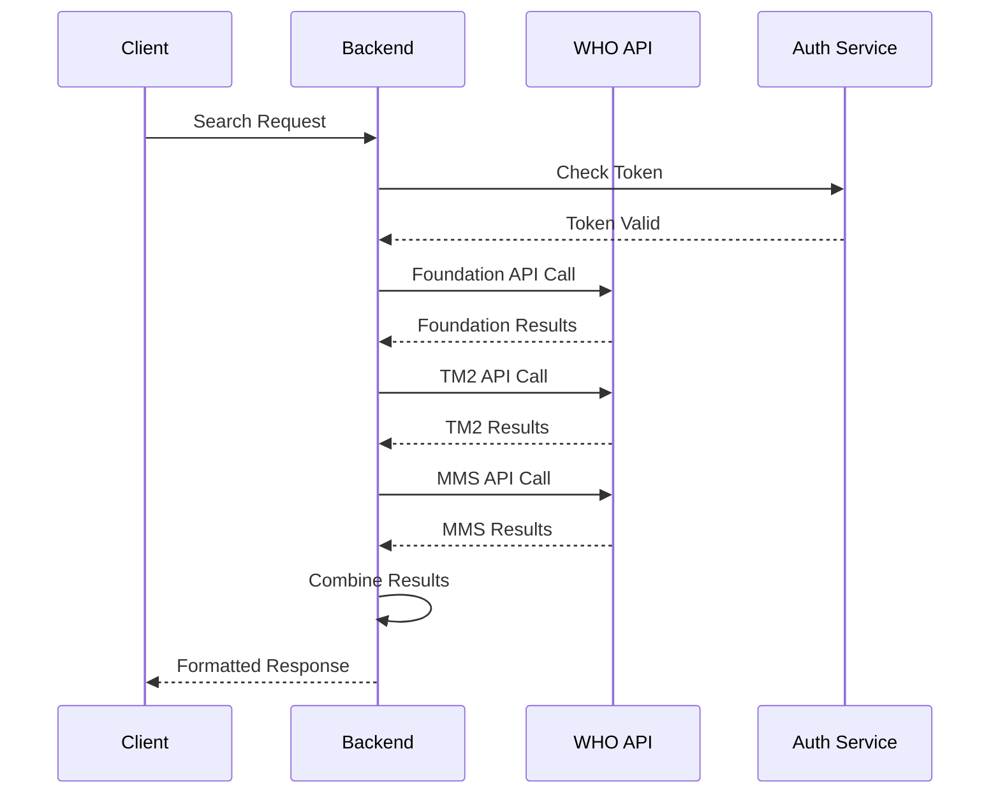

## Database Schema

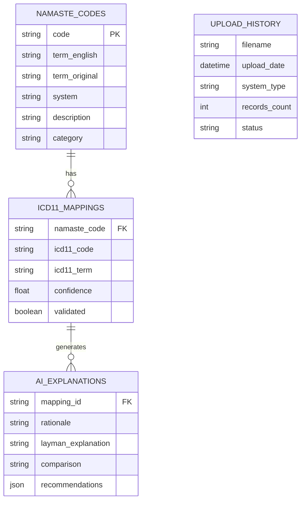

## Security Architecture

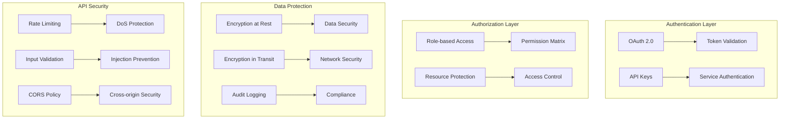

## Performance Optimization

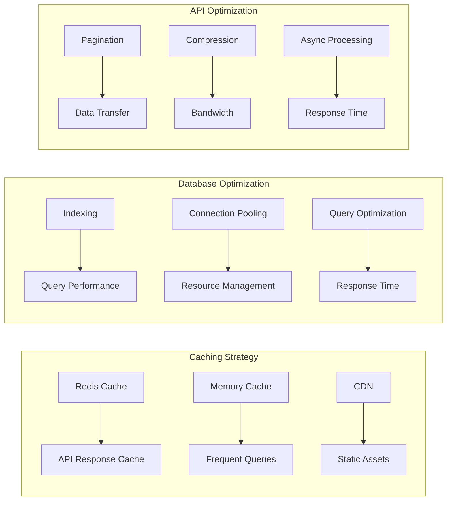

## Deployment Architecture

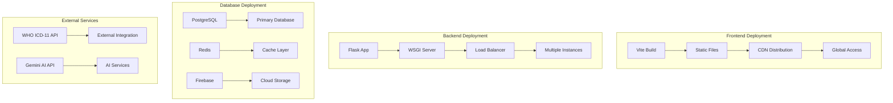

## Monitoring & Analytics

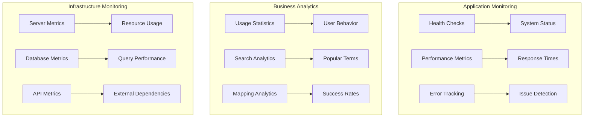

## Error Handling Strategy

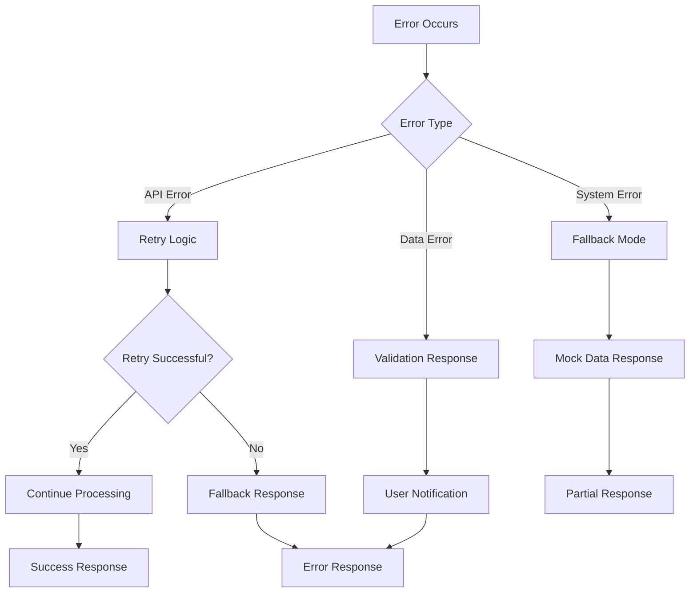

## Scalability Plan

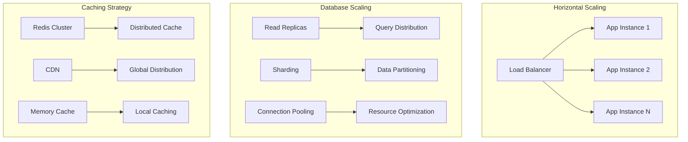

This architecture ensures NAMASTE is scalable, secure, and maintainable while providing excellent performance for traditional medicine integration with modern healthcare systems.
